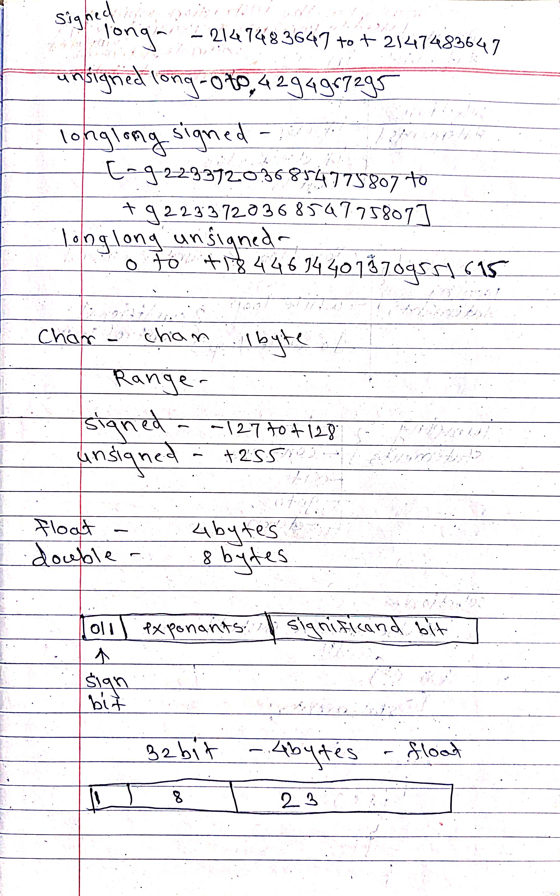
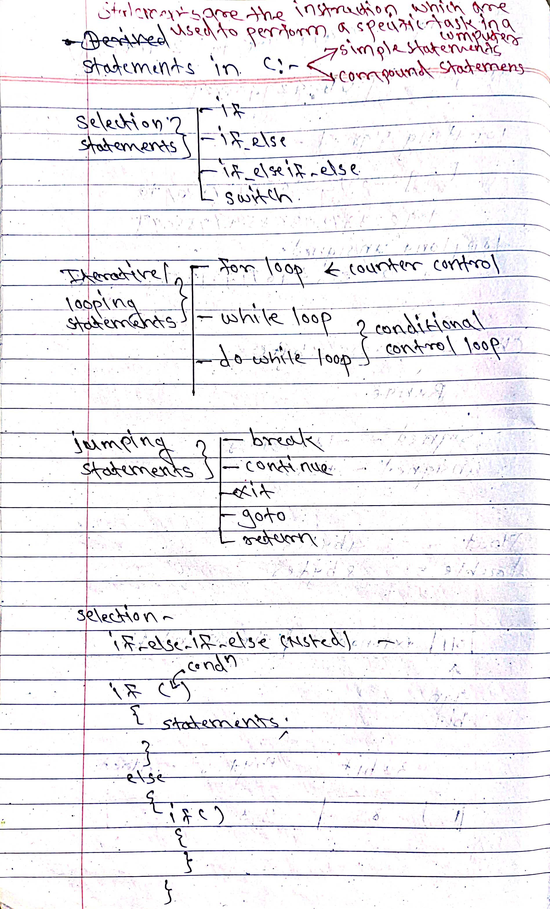
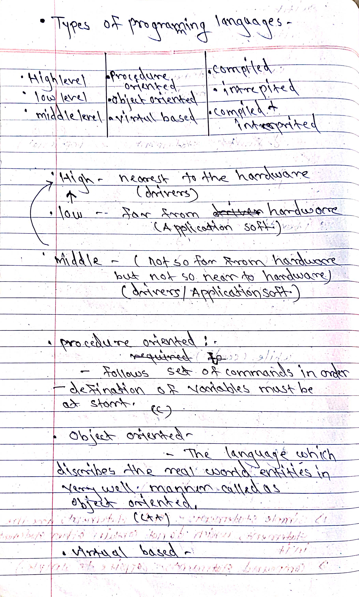
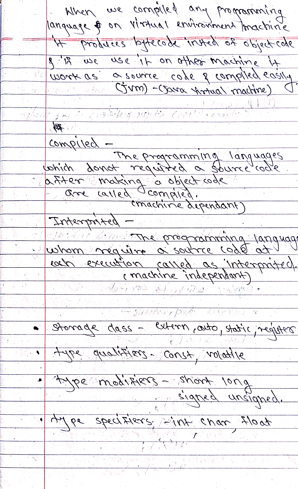
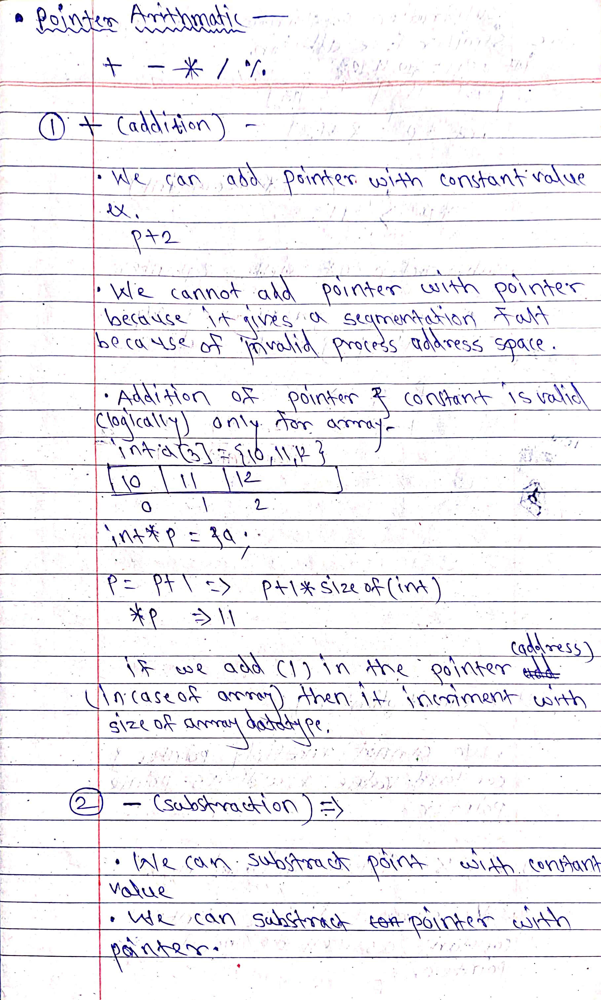
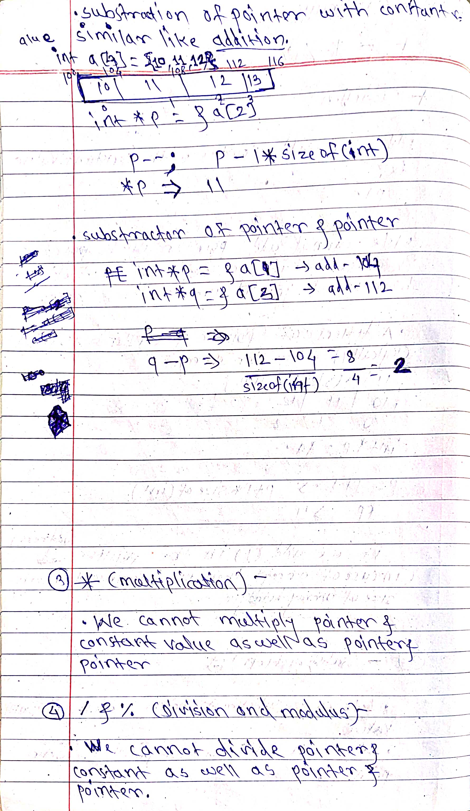
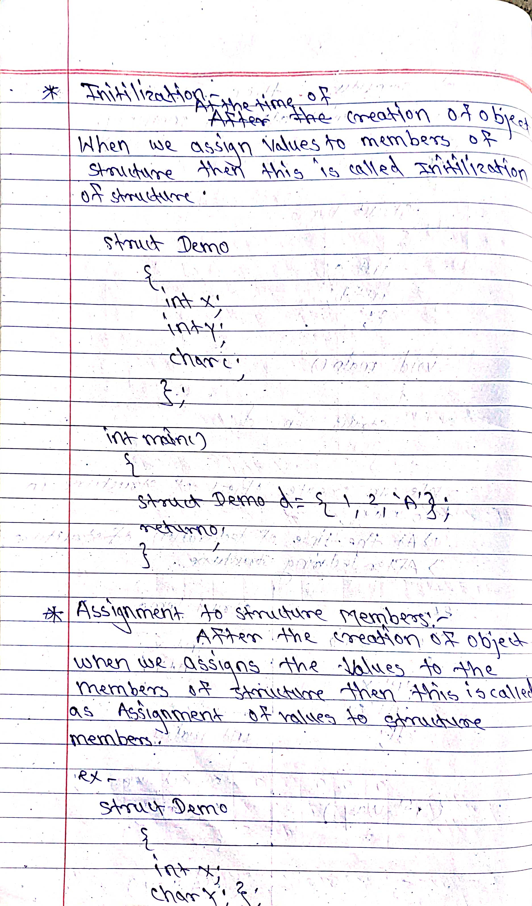

> # History : 

> 

> 

---
---

> # How OS Starts : 

> 

> # C Toolchain : 

> 

> 

---
---

> # Storage Classes in C : 

> 

> 

> 

---
---

> # C Tokens : 

> 

---
---

> # Operators in C : 

> 

> 

---
---

> # Data Types in C : 

> 

> 

---
---

> # Statements in C : 

> 

> 

---
---

> # Types of Programming Languages : 

> 

> 

---
---

> # Array in C : 

> 

> 

---
---

> # String in C : 

> 

---
---

> # 2D Array in C : 

> 

> 

---
---

> # Pointer in C : 

> 

> 

> 

> 

---
---

> # Pointer Arithmatic : 

> 

> 

---
---

> # Pointer to Pointer : 

> 

---
---

> # Constant pointer & Pointer to Constant: 

> 

---
---

> # Dynamic Memory Allocation in C: 

> 

> 

> 

> 

> 

---
---

> # Structure in C: 

> 

> 

> 

> 

> 

> 

---
---

> # Union in C: 

> 

---
---

> # Fact About scanf() : 

> 

---
